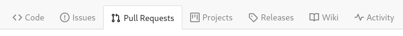
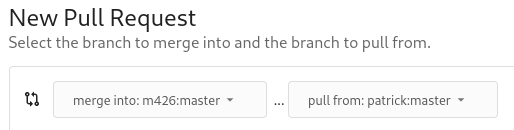
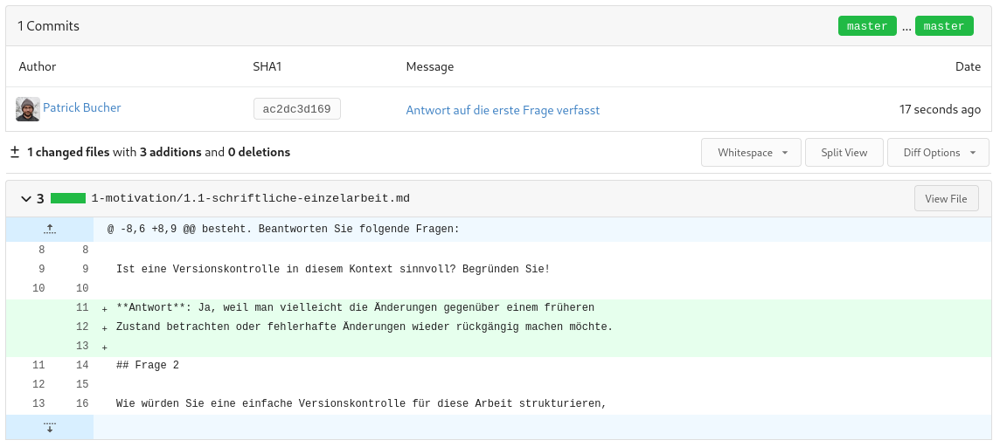

Hallo zusammen  
Von nun an werden wir hauptsächtlich über Git unsere Aufgaben austauschen.  
Hier ist nun beschrieben, wie wir hauptsächlich miteinander Arbeiten werden.

## Arbeitsweise

Um die Antworten zu den Aufgaben zusammentragen zu können, wollen wir einen
Workflow namens **Fork, Pull Request** verwenden. Dieser besteht aus zwei
Schritten:

1. **Fork**: Aus dem gemeinsamen Repository erstellen Sie Ihr persönliches
   Repository.
2. **Pull Request**: Wenn Sie in Ihrem persönlichen Repository die gewünschten
   Änderungen vorgenommen haben, können Sie mit einem sogenannten _Pull Request_
   beantragen, dass diese ins gemeinsame Repository übernommen werden.

Dieser Prozess ist weit verbreitet, gerade auf Plattformen wie GitHub. Er ist
ideal, wenn Sie an Projekten mitarbeiten wollen, für welche Sie (noch) keine
Berechtigung haben. (Dies erlaubt die Zusammenarbeit von Personen, die sich nicht
kennen oder gegenseitig nicht vertrauen. Sieht die vorgeschlagene Änderung
sinnvoll aus, ist auch keine persönliche Bekanntschaft oder persönliches
Vertrauen nötig.)

## Anleitung (Schritt für Schritt)

Doch der Reihe nach. Die folgenden Schritte beschreiben den oben erläuterten
Prozess detailliert. Sie sollten diese Anleitung Schritt für Schritt befolgen
können.

### Fork erstellen

Wenn Sie das [gemeinsame
Repository](https://github.com/vonflmar/M426-Inf20d.git) offen
haben, sehen Sie oben rechts einen Button mit der Bezeichnung "fork" (engl.
"Gabel", symbolisch für "Verzweigung"):

Klicken Sie auf diesen Button, und das gemeinsame Repository wird in ein
persönliches Repository kopiert. (Sie brauchen nichts weiter einzustellen und
können das folgende Formular bestätigen.)

Stellen Sie nun sicher, dass Sie auf der Seite Ihres persönlichen Repositories
sind, also z.B. `peterp/M426-Inf20d` statt
`vonflmar/M426-Inf20d`. Dies ist nun ihre persönliche Kopie, und Sie
können grundsätzlich damit machen, was Sie wollen. Niemand ausser der
Administrator kann Ihre Änderungen sehen.

### Das Repository klonen

Nun können Sie das Repository klonen. Die URL dazu erhalten Sie von der
Repository-Seite. **Achtung: Verwenden Sie die URL von ihrer persönliche
Repository-Seite, nicht von der gemeinsamen!** Wählen Sie `HTTPS` aus, und
kopieren Sie die URL mit dem entsprechenden Symbol:

Anschliessend können Sie das Repository folgendermassen klonen:

    $ git clone https://github.com/[ihrName]/M426-Inf20d.git

Sie werden aufgefordert, Ihren Benutzernamen und Ihr Passwort einzugeben.

#### Wichtiger Hinweis für Windows-Nutzer im Schulnetzwerk

Da es trotz der Installation des korrekten Root-Zertifikats der Schule zu
Problemen mit HTTPS kommt, müssen Sie die SSL/TLS-Verifikation deaktivieren,
solange Sie am Schulnetzwerk sind.

Führen Sie folgenden Befehl aus, wenn Sie in der Schule mit Git via HTTPS arbeiten wollen:

    $ git config --global http.sslVerify false

Bevor Sie nach Hause gehen, können Sie SSL/TLS wieder aktivieren:

    $ git config --global http.sslVerify true

**Achtung**: Deaktivieren Sie SSL/TLS nie ausserhalb eines schulischen Kontexts!

### Änderungen vornehmen

Für diesen Teil wechseln Sie nun in ihre bevorzugte Entwicklungsumgebung oder
verwenden einen einfachen Texteditor. Wenn Sie beispielsweise Visual Studio Code
verwenden, ist es sinnvoll, das Repository als Ordner zu öffnen.

Wenn Sie mit den lokalen Änderungen fertig sind, werden diese folgendermassen in
Ihrem Repository abgespeichert und auf den Server übertragen:

    $ git add .
    $ git commit -m 'Erster Test geschrieben'
    $ git push

Ihre Anpassungen liegen nun in Ihrem persönlichen Repository, nicht im
gemeinsamen.

### Änderungen mittels Pull Request austauschen

Damit die ganze Klasse von Ihren Antworten profitieren kann ‒ und Sie von den
Antworten der anderen Lernenden ‒ sollen Sie Ihre Änderungen mittels _Pull
Request_ ins gemeinsame Repository übertragen.

Ein Pull Request ist als Antrag zu verstehen, nach dem Motto: "Bitte, _ziehen_
(engl. 'pull') Sie diese Änderungen aus meinem Repository!"

Klicken Sie hierzu den Reiter (Tab) "Pull Requests" an:

Mit dem Button "New Pull Request" können Sie einen neuen Pull Request erstellen.

Wählen Sie links ("merge into") das gemeinsame Repository (`m426`) und rechts
("pull from") ihr persönliches aus:

Sie sollten nun unten eine Vorschau mit den Änderungen zu sehen bekommen:

Klicken Sie auf den grünen Button "New Pull Request" und anschliessend auf
"Create Pull Request" (optional können Sie den Pull Request als Gesamtes
kommentieren).

Die Lehrperson kann Ihren Pull Request nun:

- ablehnen, wodurch sich nichts am gemeinsamen Repository ändert
- akzeptieren, wodurch Ihre Änderungen ins gemeinsame Repository übernommen
  werden
- kommentieren, um Anpassungen zu verlangen

Im letzten Fall nehmen Sie wiederum lokale Änderungen vor, die Sie in Ihr
persönliches Repository übernehmen. Sie können auf den Kommentar der Lehrperson
antworten, dass Sie die notwendigen Änderungen nun vorgenommen haben. Der Pull
Request wird automatisch um diese Änderungen ergänzt.

### Ihr Repository aktuell halten

Möchten Sie nur einmalig Änderungen am gemeinsamen Repository durchführen,
brauchen Sie nichts weiteres zu tun.

Haben Sie aber weitere Änderungsvorschläge, können Sie weitere Pull Requests in
Auftrag geben.

Da zwischen Ihren Änderungen eine gewisse Zeit vergeht, kann es sein, dass
inzwischen andere Lernende Pull Requests gemacht haben, die auch angenommen
worden sind. Sie müssen also ihr persönliches Repository zunächst lokal
aktualisieren, bevor Sie weiterarbeiten können. (So vermeiden Sie Konflikte und
evtl. sogar doppelte Arbeit, weil jemand Ihrer Klasse vielleicht schon die
Änderungen vorgenommen hat, die Sie hätten machen wollen.)

**Achtung: führen Sie die folgenden Schritte unbedingt im Verzeichnis ihres
Repositories durch!**

Um die Änderungen vom gemeinsamen Repository holen zu können, müssen Sie
dieses zunächst als sog. _Remote_ hinzufügen:

    $ git remote add upstream https://github.com/vonflmar/M426-Inf20d.git

**Wichtig:** Ersetzen Sie die obige URL durch diejenige des Repositories, von
dem Sie die Änderungen übernehmen wollen!

Das neue Remote wird gemäss Konvention "upstream" genannt (wörtlich
"flussaufwärts", bildlich "vorgelagert"). Ihr persönliches Repository ist
weiterhin unter dem Remote `origin` verfügbar, das standardmässig verwendet
wird.

Nun können Sie die Änderungen vom Remote `upstream` laden und lokal anwenden:

    $ git fetch upstream
    $ git merge upstream/main

Oder in einem Schritt:

    $ git pull upstream main

Sie werden erneut aufgefordert, Ihren Benutzernamen und Ihr Passwort einzugeben.

Nun ist Ihr Repository wieder auf dem aktuellsten Stand, und Sie können damit
weiterarbeiten. Der Befehl `git merge` führt alle neueren Änderungen von
`upstream/main` bei Ihnen im lokalen Repository ein.

Sollte bei diesem Vorgang ein Merge-Konflikt entstehen, müssen Sie diesen in der
betreffenden Datei selbständig auflösen. Anschliessend können Sie die
korrigierte Datei mittels `git add` wieder hinzufügen und per `git commit`
festschreiben und anschliessend per `git push origin` zurück auf ihr
persönliches, serverseitiges Repository übertragen.

**Wichtig**: Führen Sie die letzten beiden Befehle (`fetch`, `merge`) immer aus,
bevor Sie nach einiger Zeit an einem "geforktem" Repository weiterarbeiten.
(Das `remote` muss nur einmal hinzugefügt werden.) Wenn viele Leute gleichzeitig
an einem Repository arbeiten, ist es sinnvoll, `git merge` auszuführen, bevor
Sie lokal die nächsten Änderungen vornehmen wollen.
